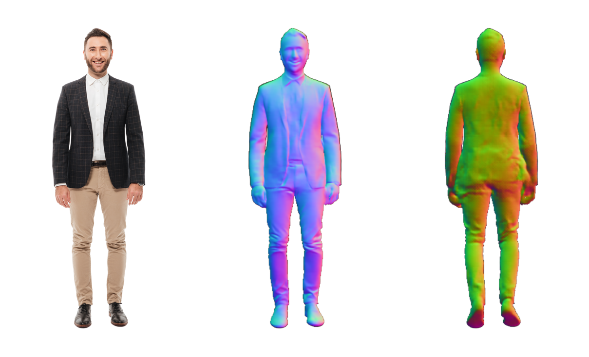
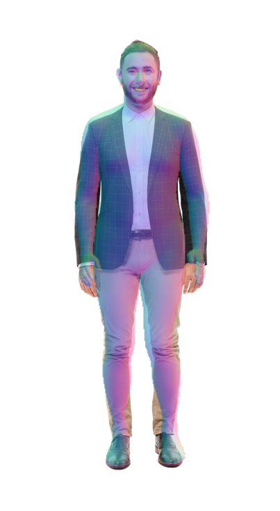
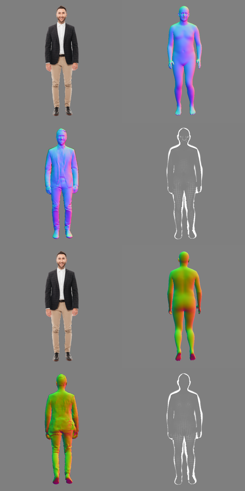

# Img2Smpl
a wheel: single view avatar 2 smpl and normal


## Environment setup

```sh
# install libraries
apt-get install -y \
    libglfw3-dev \
    libgles2-mesa-dev \
    libglib2.0-0 \
    libosmesa6-dev \
# install requirements
pip install -r requirements.txt
# install kaolin
pip install kaolin==0.13.0 -f https://nvidia-kaolin.s3.us-east-2.amazonaws.com/torch-${YOUR_TORCH_VERSION}_${YOUR_CUDA_VERSION}.html

```

## How to run
```
# download MODNet to Img2Smpl/thirdparties/MODNet
mkdir thirdparties
git clone https://github.com/ZHKKKe/MODNet.git


# download smpl data
sh scripts/download.sh 

# 0 is the GPU device id
sh scripts/run1.sh input/aaa/aaa.png exp/aaa 0
```
# Results


